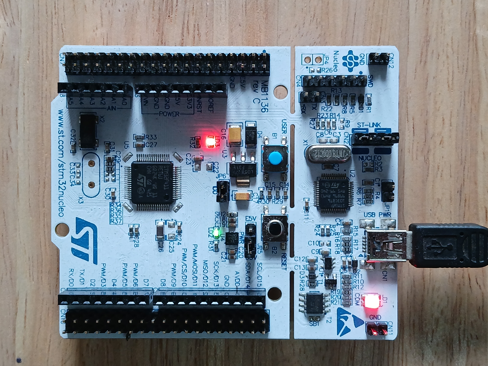

# Bare-metal series: STM32

This repository contains bare-metal C code for STM32 microcontrollers, with a custom **build system**, **linker script, startup file**, **peripheral drivers**, and **application-level code examples** which are re-written from scratch without using any IDE or third-party libraries. By building everything from scratch, you'll gain a deeper understanding of how Arm Cortex-M based MCU works under the hood,  how embedded build systems are set up, and how Hardware Abstraction Layers (HALs) are implemented.



# Prerequisites 

The following hardware, docs and tools are required along the development process.

## Target Platform

In this guide, [STM32 NUCLEO-F411RE](https://www.st.com/en/microcontrollers-microprocessors/stm32f411re.html) development board is used as an example. On board [ST-LINK](https://www.st.com/en/development-tools/st-link-v2.html) can be used for flashing and debugging the firmware. It's recommended to update the [ST-Link firmware](https://www.st.com/en/development-tools/stsw-link007.html) before use.

## Docs

In bare-metal programming, we need to understand mainly three types of information.

* How the hardware works: To understand how mcu works, start by reading its **Datasheet**, and to get an overview of CPU architecture, we can refer to the **Architecture Reference Manual or User Guide**. For information on using the development board, check out the **Board User Manual**.

* How the hardware interface are presented: To program a specific microcontroller, it's important to understand **how its registers, peripherals and memory are organized and how they can be accessed**. These details are primarily documented in the **Technical Reference Manual**.

* How to write the software: To write the software, you can choose your level of abstraction—from low-level bare-metal programming usually in **Assembly or C**, to higher-level development using vendor-provided libraries and HAL. In this guide, we’ll focus on **bare-metal C**, with occasional references to ST’s low-level drivers and HAL.

|                 | CPU                                                                                 | MCU Datasheet                                                                     | Reference Manual                                                                                                                                   | Board                                                                                                                       | HAL                                                                                                                                                           |
| --------------- | ----------------------------------------------------------------------------------- | --------------------------------------------------------------------------------- | -------------------------------------------------------------------------------------------------------------------------------------------------- | --------------------------------------------------------------------------------------------------------------------------- | ------------------------------------------------------------------------------------------------------------------------------------------------------------- |
| **STM32F411RE** | [Cortex-M4 User Guide](https://developer.arm.com/documentation/dui0553/latest/)<br> | [STM32F411RE Datasheet](https://www.st.com/resource/en/datasheet/stm32f411re.pdf) | [RM0383 Reference manual](https://www.st.com/resource/en/reference_manual/rm0383-stm32f411xce-advanced-armbased-32bit-mcus-stmicroelectronics.pdf) | [UM1724 User manual](https://www.st.com/resource/en/user_manual/um1724-stm32-nucleo64-boards-mb1136-stmicroelectronics.pdf) | [STM32F4 HAL and low-layer drivers](https://www.st.com/resource/en/user_manual/um1725-description-of-stm32f4-hal-and-lowlayer-drivers-stmicroelectronics.pdf) |
## Tools

* **Compiler:** [Arm GNU Toolchain (arm-none-eabi)](https://developer.arm.com/downloads/-/arm-gnu-toolchain-downloads)
* **Build Automation:** [GNU Make](https://www.gnu.org/software/make/)
* **Version Control:** [Git](https://git-scm.com/)
* **Flashing Firmware:** [OpenOCD](https://openocd.org/)

### Setup on Linux (Debian)

#### Install requirements

```
$ sudo apt-get update -y
$ sudo apt-get install build-essential make git openocd 
```

#### Download and Extract Arm GNU Toolchain

Download from: https://developer.arm.com/downloads/-/arm-gnu-toolchain-downloads

```
wget https://developer.arm.com/-/media/Files/downloads/gnu/14.2.rel1/binrel/arm-gnu-toolchain-14.2.rel1-x86_64-arm-none-eabi.tar.xz
```

```
tar -xf arm-gnu-toolchain-14.2.rel1-x86_64-arm-none-eabi.tar.xz
```

Get the path to `bin` directory and add to `PATH` permanently.
```
nano ~/.bashrc
```

Append this line at the end:
```
export PATH="$PATH:/your/path/to/bin"
```

Check if it works:
```
$ source ~/.bashrc
$ which arm-none-eabi-gcc
```

# Directory Structure

```
.
├── build
│   ├── bin
│   ├── stm32_ls.ld
│   └── stm32_startup.c
├── docs
│   └── images
├── drivers
│   ├── gpio.c
│   └── systick.c
│   └── // TODO: Add more drivers (eg. UART, I2C. ADC .etc)
├── examples
│   └── ...
├── include
│   ├── stm32f411re.h
│   ├── gpio.h
│   ├── rcc.h
│   └── systick.h
└── Makefile
└── README.md
```

| Directory   | Description                                          |
| ----------- | ---------------------------------------------------- |
| `build/`    | Including linkerscript, startupfile and build output |
| `build/bin` | Build output (executable and map file)               |
| `drivers/`  | Source files for peripheral drvers                   |
| `examples/` | Source files for application code examples           |
| `include/`  | Header files                                         |

# Quick Start

To get started, first clone this repository:
```
git clone https://github.com/kyawminkhant-hub/bare-metal-stm32.git
```

In the `Makefile`, change `ROOT_DIR` variable with the path to this directory.
```
ROOT_DIR := /path/to/bare-metal-stm32
```

The target code can built using `make` command in the top-level directory. To build a specific example, update the target path in the `Makefile` by modifying the `APP_DIR` variable:
```
APP_DIR := $(ROOT_DIR)/examples/Blinky
```

In this example, the target is set to the `Blinky` code example.

From the top-level directory, run
```
make build
```

This will compile the source files, generating object files alongside their corresponding source files. The final output files — `final.elf` and `final.map` — will be placed in the `build/bin` directory.

After that, connect your development board via USB and run:
```
make
```

This will rebuild the project if there are any changes in the source files and start **OpenOCD** to flash the firmware.

To start flashing the firmware,
* Open a new terminal and launch **GDB**:
```
arm-none-eabi-gdb
```

* Connect to the **OpenOCD** server (which listens on port `3333` by default):
```
target remote localhost:3333
```

* Load the ELF executable from the `build/bin` directory:
```
file ./build/bin/final.elf
```

* Flash the program to the board:
```
load
```

* Start program execution:
```
monitor resume
```

* Exit GDB, `quit`

At this point, you should see the on-board LED (`LD2` on the NUCLEO-F411RE) start blinking, indicating that the firmware is running successfully.
